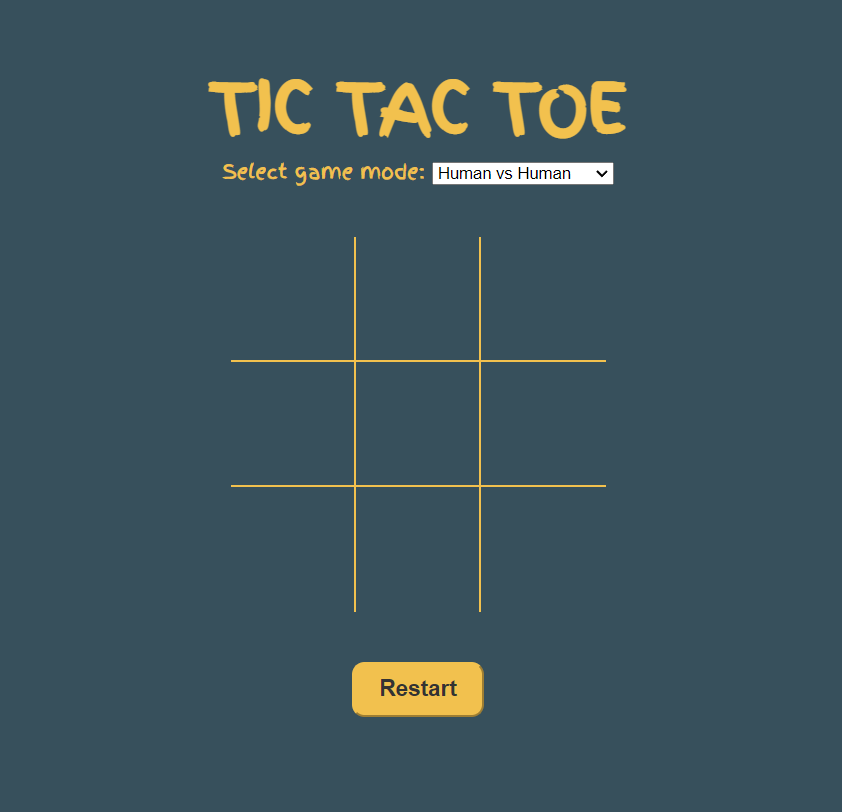

# TicTacToe

This is a web-based game of Tic Tac Toe, built using HTML, CSS, and JavaScript. It features a game board with clickable boxes, a game mode selector, and a restart button. The game can be played in two modes: human vs. human, or human vs. computer. The computer opponent will make a random move after the human player makes their move. 
# [PLAY TIC TAC TOE](https://playtictactoe.azurewebsites.net/)

